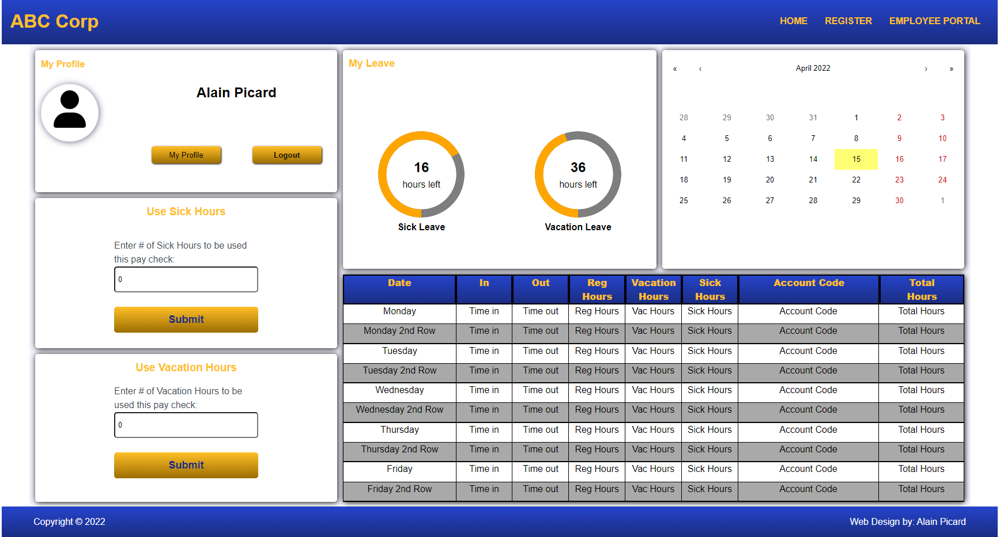

#### To Run the Application do the following:

- To Create a MySQL Database named "employeeservice" you will execute the following command:
    >`create database employeeservice;`

- To Create a new user in your MySQL DB named "employee01" with password "password" (Do not use in production) you will execute the following command:

    >`create user 'employee01'@'%' identified by 'password';`

 

To start the Application, In the front-end directory, you can run:

### `npm start`

Runs the app in the development mode.\
Open [http://localhost:3000](http://localhost:3000) to view it in your browser.

