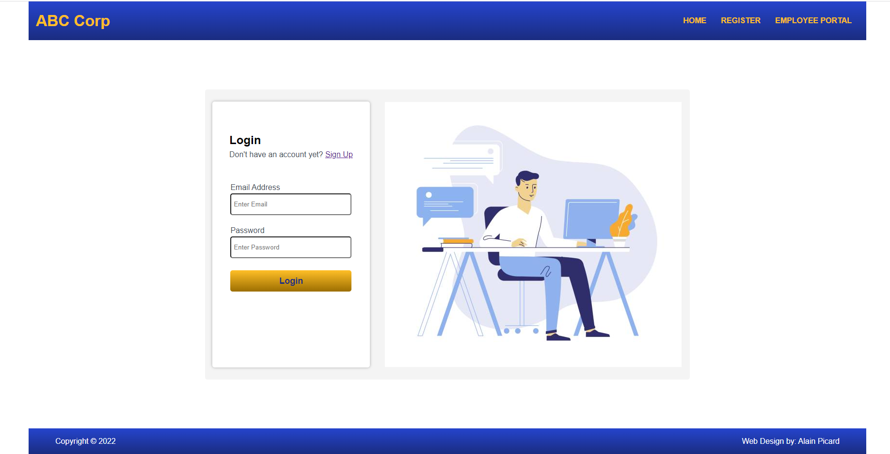
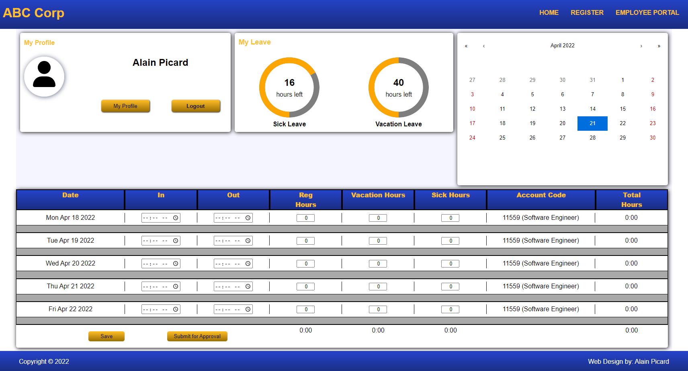

#### To Run the Application do the following:

- To Create a MySQL Database named "employeeservice" you will execute the following command:
    >`create database employeeservice;`

- To Create a new user in your MySQL DB named "employee01" with password "password" (Do not use in production) you will execute the following command:

    >`create user 'employee01'@'%' identified by 'password';`

- To grant access to "employeeservice" database for new user named "employee01" execute the following command:
  >`grant all on employeeservice.* to 'employee01'@'%';`

 

To start the front-end of the Application:

- Navigate (cd) to the front-end directory and execute:

#### `npm start`

Runs the app in the development mode.\
Open [http://localhost:3000](http://localhost:3000) to view it in your browser.

To start the back-end of the Application:

- Open Application in Intellij and run `EmployeeManagementApiApplication`
  (Be sure you have a MySql Database running on your machine)

